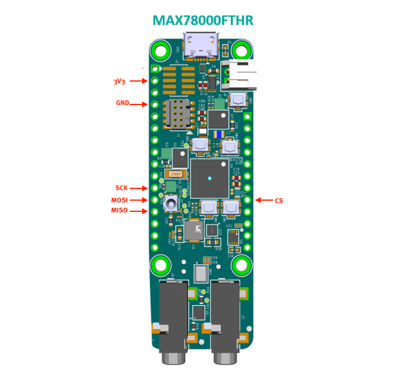

# Guide for FRAM Interfacing

## Required Hardware:
1. [MAX78000EVKIT](https://www.maximintegrated.com/en/products/microcontrollers/MAX78000EVKIT.html) OR [MAX78000FTHR](https://www.maximintegrated.com/en/products/microcontrollers/MAX78000FTHR.html)
2. ARM Cortex debugger like JLINK debugger (e.g. [J-Link EDU Mini](https://www.adafruit.com/product/3571?gclid=EAIaIQobChMIqeXO9fvS7QIVEI3ICh3I5g0TEAQYAiABEgJDwvD_BwE)) OR [MAX32625PICO](https://www.maximintegrated.com/en/products/microcontrollers/MAX32625PICO.html)
3. [Adafruit FRAM breakout board](https://www.adafruit.com/product/4719)

## FRAM Datasheet:
[MB85RS4MT](https://www.fujitsu.com/global/documents/products/devices/semiconductor/fram/lineup/MB85RS4MT-DS501-00053-1v0-E.pdf)

## Pin Connections with MAX78000 EVKIT:
3V3 -> 3V3

GND -> GND

SCK -> Pin 16 of camera header (J4)

MISO -> Pin 15 of camera header (J4)

MOSI -> Pin 14 of camera header (J4)

CS -> Pin 13 of camera header (J4)

WP -> 3V3

Hold -> 3V3

See figure below for pins

## Pin Connections with MAX78000 FTHR Board:
3V3 -> 3V3

GND -> GND

SCK -> P0_7

MISO -> P0_6

MOSI -> P0_5

CS -> P0_11

WP -> 3V3

Hold -> 3V3

See figure below for pins

